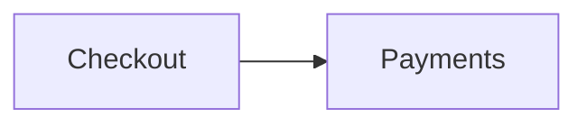
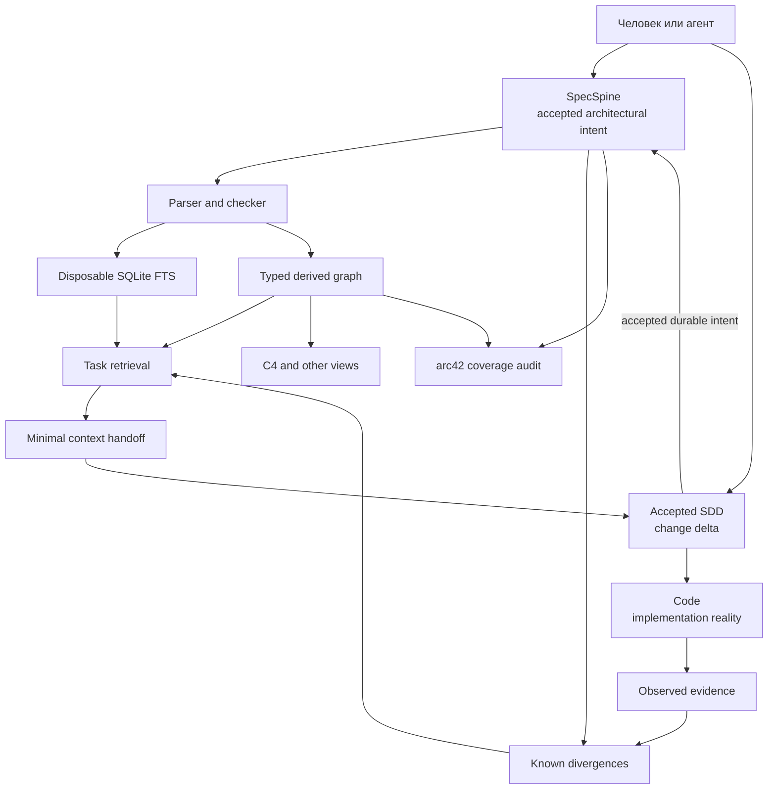

новый формат specspine

---

# SpecSpine Markdown Graph Format and Retrieval Contract

## 1. Назначение

SpecSpine — человекочитаемый слой долговременной архитектурной памяти для людей и ИИ-агентов.

Он должен:

- быстро объяснять архитектуру без чтения всей кодовой базы;
- сохранять ответственность, границы, значимое поведение и ограничения;
- поддерживать трассировку обычными скриптами;
- образовывать связный типизированный граф;
- предоставлять минимальный task-specific контекст;
- предоставлять возможность быстро вынимать полную необходимую информацию при помощи только скриптов;
- сохранять неопределённость и происхождение утверждений;
- не дублировать исходный код;
- оставаться полезным без SQLite, CLI, генератора или специального редактора.

Главный критерий:

> Новый агент без истории разговора должен найти канонического владельца задачи, получить необходимые соседние ограничения и понять архитектурные риски значительно быстрее и дешевле, чем при исследовании кода.

## 2. Нормативные термины

- **MUST** — обязательное требование.
- **SHOULD** — рекомендуемое требование; отклонение требует причины.
- **MAY** — необязательная возможность.
- **Canonical Markdown** — авторские Markdown-документы SpecSpine.
- **Derived artifact** — полностью пересобираемый индекс, граф, diagram view, backlink или context pack.
- **Specification node** — один Markdown-документ, канонически владеющий архитектурным концептом.
- **Semantic statement** — адресуемое решение, ограничение, наблюдение, вывод или открытый вопрос.
- **Typed relationship** — направленная архитектурная связь из таблицы `Relationships`.
- **Navigation link** — обычная Markdown-ссылка без типа отношения.
- **Task closure** — минимальное связное множество архитектурных утверждений, необходимое для конкретной задачи.
- **Script-only extraction** — детерминированная сборка task closure из
  Canonical Markdown и производного индекса без участия ИИ-модели и без чтения
  исходного кода.
- **Architectural intent** — принятые долгоживущие ответственности, границы,
  решения и ограничения, которые должна сохранять реализация.
- **Implementation reality** — текущее состояние кода, тестов и runtime,
  которое может расходиться с architectural intent.
- **Known divergence** — явно связанная пара accepted intent и repository
  observation, показывающая известное архитектурно значимое расхождение.
- **Coverage** — явная оценка того, какие области архитектуры документированы
  достаточно, частично или ещё не документированы.

## 3. Основные принципы

### 3.1 Markdown является источником истины

Каноническое направление данных:

```text
Markdown
    → parser
    → derived graph/index
    → diagrams/reports/context packs
```

Граф, SQLite и JSONL MUST NOT становиться независимыми источниками архитектурной истины.

При расхождении:

```text
Markdown прав
Derived artifacts перестраиваются
```

### 3.2 Документ должен сохранять смысл без инструментов

Читатель MUST понимать:

- что описывает документ;
- за что концепт отвечает;
- где проходят его границы;
- каково значимое поведение;
- с чем и почему он связан;
- какие ограничения действуют;
- какая неопределённость остаётся.

Для понимания MUST NOT требоваться:

- YAML parser;
- SQLite;
- generated graph;
- CLI;
- schema registry;
- C4 renderer;
- внешний SaaS.

### 3.3 Один концепт — один канонический владелец

Полное определение концепта MUST находиться в одном документе.

Другие документы MAY содержать:

- краткий локальный контекст;
- ссылку на владельца;
- описание собственной стороны отношения.

Они MUST NOT поддерживать конкурирующие копии:

- правил;
- решений;
- lifecycle;
- интерфейсных контрактов;
- retry policies;
- data ownership;
- инвариантов.

### 3.4 Авторские данные не дублируются

Одна архитектурная связь авторски хранится один раз.

Из неё MAY генерироваться:

- обратная связь;
- C4 edge;
- dependency view;
- impact report;
- context-pack entry.

Визуальное повторение в производных представлениях допустимо. Ручное обслуживание нескольких копий запрещено.

### 3.5 Формализуется только необходимый минимум

Обязательной машинной структурой являются:

1. идентичность документа;
2. Markdown-секции;
3. типизированные отношения;
4. выборочные semantic statements;
5. provenance repository observations.

Не формализуются:

- каждый абзац;
- локальные алгоритмы;
- функции и переменные;
- каждый тест;
- очевидный control flow;
- временные runtime-метрики;
- feature acceptance criteria;
- implementation tasks;
- delivery status.

### 3.6 SpecSpine является SSOT архитектурного intent

SpecSpine является каноническим источником:

- долгоживущих responsibilities и boundaries;
- архитектурного ownership;
- typed relationships;
- accepted decisions и constraints;
- архитектурно значимой неопределённости;
- известных расхождений между intent и implementation reality.

SpecSpine MUST NOT заявляться универсальным SSOT всей системы.

Разделение авторитетов:

| Вид знания | Канонический источник |
|---|---|
| Долгоживущий architectural intent | SpecSpine |
| Дельта конкретного принятого изменения | SDD/change specification |
| Текущая реализация | Исходный код |
| Текущее наблюдаемое поведение | Код, тесты и runtime evidence |
| Delivery status и backlog | Внешняя workflow-система |

SpecSpine принимает только явно accepted intent. Черновик SDD, предположение
агента или существующая реализация MUST NOT самостоятельно создавать либо
изменять Decision или Constraint. Процесс approval остаётся у человека или
явно назначенного внешнего workflow.

Отсутствие гарантии code/spec conformance не разрешает агенту игнорировать
SpecSpine. Оно означает, что conformance нельзя предполагать без evidence.

### 3.7 Расхождение сохраняется, а не разрешается молча

Если accepted intent и implementation reality расходятся:

- код не отменяет Decision или Constraint;
- Decision или Constraint не доказывает состояние кода;
- агент MUST NOT молча выбирать одну сторону;
- значимое расхождение SHOULD быть записано как `Known divergence`;
- исправление drift MUST быть отдельно авторизовано, если оно выходит за scope;
- новый accepted SDD MAY supersede существующий intent;
- долговременная часть принятого SDD MUST быть перенесена в SpecSpine.

Неизвестная причина расхождения сохраняется в `Inferred` или `Open questions`.

## 4. Файловая организация

SpecSpine MUST иметь корневой `README.md`.

По умолчанию используется плоская организация:

```text
specspine/
├── README.md
├── authentication.md
├── session-management.md
├── external-identities.md
├── payment-processing.md
└── retry-policy.md
```

Директории MAY добавляться, если несколько документов образуют устойчивую область:

```text
specspine/
├── README.md
├── client/
├── server/
├── payments/
└── platform/
```

Путь:

- организует файлы;
- обеспечивает Markdown-навигацию;
- MUST NOT определять архитектурную иерархию;
- MAY изменяться без изменения document ID.

Файлы SHOULD использовать `lowercase-kebab-case.md`.

Имена SHOULD описывать устойчивые концепты:

```text
payment-processing.md
session-management.md
notification-delivery.md
```

Не следует использовать временные feature-имена:

```text
add-google-login.md
feature-123.md
fix-payment-retry.md
```

## 5. Архитектурный индекс

`README.md` является точкой входа, но не семантическим родителем всех документов.

Он MUST содержать:

```markdown
# Архитектура проекта

**ID:** `project-architecture` · **Kind:** `index`

Краткое назначение проекта и его архитектурный контекст.

## Architecture map

- [Обработка заказов](order-processing.md) — владеет жизненным циклом заказа.
- [Платежи](payment-processing.md) — владеют попытками и результатами оплаты.
- [Запасы](inventory.md) — владеют доступностью и резервированием товаров.

## Coverage

### Mapped

- Обработка заказов и платежей.

### Partially mapped

- Запасы — известны responsibility и interfaces, но не восстановлены
  failure behavior и deployment constraints.

### Unmapped

- Reporting subsystem.
```

Индекс SHOULD содержать:

- назначение проекта;
- основные внешние границы;
- компактную architecture map;
- системные решения;
- системные ограничения;
- архитектурно значимые открытые вопросы.
- качественный `Coverage` со статусами `Mapped`, `Partially mapped` и
  `Unmapped`.

Индекс MUST NOT становиться каталогом каждого документа. Детальные узлы MAY быть достижимы через другие спецификации.

## 6. Формат specification node

### 6.1 Минимальный документ

```markdown
# Обработка заказов

**ID:** `order-processing` · **Kind:** `subsystem`

Принимает заказы, владеет их жизненным циклом и координирует
резервирование, оплату и доставку.

## Responsibility

- владеет состоянием заказа;
- проверяет допустимые переходы;
- координирует выполнение заказа.

## Relationships

| Relation | Target | Meaning |
|---|---|---|
| `depends-on` | [Запасы](inventory.md) | Получает результат резервирования |
| `depends-on` | [Платежи](payments.md) | Запрашивает списание средств |
```

Каждый specification node, кроме `Kind: index`, MUST иметь:

1. ровно один H1;
2. identity line;
3. summary сразу после identity line;
4. непустую секцию `Responsibility`.

`Kind: index` следует отдельному контракту раздела «Архитектурный индекс» и
не обязан иметь `Responsibility`.

Остальные секции добавляются только при наличии полезного содержания.

### 6.2 Identity line

Формат:

```markdown
**ID:** `order-processing` · **Kind:** `subsystem`
```

Грамматика ID:

```regex
^[a-z0-9]+(?:-[a-z0-9]+)*$
```

ID:

- MUST быть уникальным внутри Spine;
- MUST оставаться стабильным после публикации;
- MUST NOT кодировать путь или положение в иерархии;
- MUST NOT переиспользоваться после удаления;
- MUST NOT изменяться при переименовании документа;
- MUST NOT изменяться при перемещении файла.

### 6.3 Kind

Core kinds:

```text
index
system
subsystem
component
capability
behavior
interface
data
policy
invariant
decision
deployment
concept
```

Значение `Kind`:

- помогает поиску и построению views;
- не определяет обязательный набор секций;
- не создаёт иерархию;
- не определяет авторитет утверждений.

Проектные расширения MAY использовать:

```text
x-<project-kind>
```

Например:

```text
x-workflow
x-control-plane
x-device-profile
```

Unknown core-like kind SHOULD вызывать warning. `x-*` MUST приниматься checker.

### 6.4 Aliases

Настоящие устойчивые альтернативные названия MAY быть указаны сразу после identity line:

```markdown
**Aliases:** Checkout, order orchestration
```

Aliases:

- используются для exact retrieval;
- MUST быть реальными терминами проекта;
- MUST NOT использоваться для keyword stuffing;
- MUST NOT повторять произвольные поисковые фразы;
- SHOULD быть краткими.

Если aliases отсутствуют, строка опускается.

### 6.5 Summary

Summary — первый обычный абзац после identity и aliases.

Он SHOULD содержать:

- назначение концепта;
- каноническую ответственность;
- архитектурную значимость;
- основной доменный термин;
- важный code/domain alias, если он реально используется.

Summary SHOULD занимать 1–3 предложения.

Он MUST NOT:

- перечислять файлы;
- пересказывать функции;
- повторять `Responsibility` целиком;
- содержать список keywords;
- описывать локальные алгоритмы.

## 7. Секции документа

### 7.1 Responsibility

Обязательная секция.

Она отвечает на вопрос:

> Чем канонически владеет этот концепт?

Хорошо:

```markdown
## Responsibility

- создаёт и поддерживает application sessions;
- владеет lifecycle refresh tokens;
- предоставляет provider-independent authenticated context.
```

Плохо:

```markdown
## Responsibility

- содержит SessionService;
- вызывает TokenRepository;
- использует refreshToken().
```

### 7.2 Boundaries

Описывает:

- что принадлежит концепту;
- что находится за его пределами;
- какой сосед является каноническим владельцем;
- где чаще всего возникает путаница ownership.

```markdown
## Boundaries

Проверка пароля принадлежит
[Парольной аутентификации](password-authentication.md).

Сессии не владеют provider access tokens.
```

### 7.3 Behavior

Описывает значимое:

- внешне наблюдаемое поведение;
- архитектурно значимую координацию;
- важные переходы;
- порядок взаимодействия;
- последствия ошибок.

Не следует описывать каждый локальный branch.

### 7.4 Interfaces

Описывает:

- архитектурные inputs и outputs;
- команды;
- события;
- внешние API;
- порты;
- устойчивые контракты.

Физические payload schemas SHOULD оставаться в их канонических API/schema-источниках, если их копирование не добавляет архитектурного смысла.

### 7.5 Information model

Описывает:

- устойчивые сущности;
- концептуальные связи;
- значения;
- жизненно важные свойства;
- ownership.

Не следует копировать всю физическую database schema.

### 7.6 Data ownership

Указывает:

- кто создаёт данные;
- кто имеет право изменять их;
- кто только читает;
- какие границы консистентности существуют.

### 7.7 Lifecycle and invariants

Описывает:

- значимые состояния;
- переходы;
- необратимые состояния;
- durable truths;
- ограничения переходов.

### 7.8 Failure behavior

Описывает:

- retries;
- degradation;
- compensation;
- recovery;
- idempotency;
- uncertain outcomes;
- failure boundaries.

### 7.9 Edge cases

Содержит только архитектурно значимые edge cases:

- меняющие ownership;
- влияющие на внешнее поведение;
- затрагивающие безопасность;
- изменяющие восстановление;
- создающие неоднозначное состояние.

### 7.10 Quality attributes

Описывает устойчивые свойства:

- security;
- privacy;
- consistency;
- availability;
- latency;
- scalability;
- maintainability.

Долгоживущие quality scenarios допустимы. Feature acceptance criteria — нет.

### 7.11 Decisions

Содержит принятые архитектурные решения.

### 7.12 Constraints

Содержит принятые ограничения на допустимую архитектуру или реализацию.

### 7.13 Observed

Содержит факты, непосредственно подтверждённые repository evidence.

Observed не означает intended или required.

### 7.14 Inferred

Содержит интерпретации evidence, которые ещё не подтверждены человеком.

### 7.15 Open questions

Содержит неопределённость, значимую для будущих изменений.

Вопрос SHOULD объяснять:

- что неизвестно;
- почему это важно;
- какой downstream work не должен отвечать на него молча.

### 7.16 Implementation

Содержит только:

- owned source areas;
- ключевые entry points;
- representative files;
- устойчивые implementation boundaries.

```markdown
## Implementation

- Основная область: `src/payments/processing/`
- Provider boundary: `src/payments/providers/`
- Entry point: `src/payments/handle-result.ts`
```

Implementation paths MUST быть repository-relative inline code, а не обязательными Markdown-ссылками.

### 7.17 Terminology

Используется для локальных доменных терминов, когда отдельный glossary не нужен.

### 7.18 Risks

Содержит только устойчивые архитектурные риски.

Issue backlog и delivery state должны оставаться во внешних системах.

### 7.19 Known divergences

Содержит только известные архитектурно значимые расхождения между accepted
intent и implementation reality.

Канонический формат:

```markdown
## Known divergences

| Intended | Observed | Consequence |
|---|---|---|
| [CON-payment-idempotency](payment-invariants.md) | [OBS-provider-event-not-deduplicated](payment-processing.md) | Повторное событие может применить переход дважды |
```

Каждая строка MUST содержать:

- `Intended` — ссылку на существующий `DEC` или `CON`;
- `Observed` — ссылку на существующий `OBS`;
- `Consequence` — непустое описание архитектурного риска или влияния.

Known divergence:

- не отменяет accepted intent;
- не разрешает drift;
- не является implementation task;
- MUST сохраняться, пока observation не перепроверено;
- MUST обновляться или удаляться после подтверждённого устранения расхождения;
- SHOULD включаться в task context, если задача затрагивает любую из сторон.

Отсутствие строки в `Known divergences` MUST NOT трактоваться как доказательство
conformance, если соответствующая область не проходила явную проверку.

Таблица MUST находиться в одном каноническом документе:

- в owner затронутой responsibility;
- либо в корневом index для system-wide divergence.

Одна пара `Intended + Observed` MUST NOT вручную дублироваться в нескольких
документах. Backlinks и упоминания в context handoff являются производными.

Если расхождение предполагается, но ещё не подтверждено evidence, оно MUST
оставаться в `Inferred`, а не в этой таблице.

## 8. Типизированные отношения

### 8.1 Канонический формат

```markdown
## Relationships

| Relation | Target | Meaning |
|---|---|---|
| `depends-on` | [Запасы](inventory.md) | Получает результат резервирования |
| `constrained-by` | [CON-order-idempotency](order-invariants.md) | Запрещает повторное создание заказа |
```

Каждая строка MUST содержать:

- canonical relation token;
- ровно одну относительную Markdown-ссылку;
- непустое объяснение `Meaning`.

`Target` MAY ссылаться:

- на весь документ;
- на semantic statement через видимый semantic ID.

Semantic ID не записывается в URL fragment:

```markdown
[CON-order-idempotency](order-invariants.md)
```

Не использовать:

```markdown
[CON-order-idempotency](order-invariants.md#CON-order-idempotency)
```

### 8.2 Заголовки таблицы

Канонические заголовки:

```text
Relation | Target | Meaning
```

Локализованные заголовки MAY поддерживаться parser через конфигурацию documentation language.

Порядок колонок MUST оставаться неизменным.

### 8.3 Идентичность отношения

Производный ключ:

```text
source_document_id
+ relation_type
+ target_document_id
+ optional target_statement_id
```

Одна такая комбинация MUST иметь одну каноническую строку.

Если отношение имеет несколько важных аспектов, они объединяются в `Meaning`.

### 8.4 Направление

Строка описывает направление:

```text
source document → target
```

Обратное ребро MUST NOT поддерживаться вручную только ради навигации.

Backlinks вычисляются автоматически.

Две строки допустимы, если они выражают разные факты:

```text
payment-processing publishes payment-event
accounting consumes payment-event
```

Это не дублирование.

### 8.5 Core vocabulary

#### `contains`

Техническая композиция:

```text
system contains subsystem
subsystem contains component
```

#### `decomposes-into`

Функциональная декомпозиция ответственности:

```text
order-fulfillment decomposes-into payment-processing
```

#### `performs`

Владелец выполняет самостоятельный behavior:

```text
checkout performs create-order
```

#### `depends-on`

Общая архитектурно значимая зависимость, если более точный тип отсутствует.

Не следует использовать вместо `consumes`, `reads-from` или `constrained-by`.

#### `exposes`

Концепт предоставляет интерфейс или контракт:

```text
payments exposes payment-api
```

#### `consumes`

Концепт потребляет интерфейс, событие или команду:

```text
accounting consumes payment-event
```

#### `publishes`

Концепт публикует событие или сообщение:

```text
payments publishes payment-event
```

#### `reads-from`

Концепт читает данные, которыми не владеет.

#### `writes-to`

Концепт изменяет целевое хранилище или модель через допустимую границу.

#### `owns-data`

Концепт владеет определением или изменением данных.

#### `constrained-by`

Концепт ограничивается политикой, инвариантом, решением или semantic statement.

#### `implemented-by`

Архитектурный behavior или interface реализуется другим документированным компонентом.

Прямые source paths SHOULD оставаться в `Implementation`, а не становиться graph nodes.

#### `has-evidence`

Концепт связан с отдельным устойчивым evidence-документом.

Обычные source/test paths SHOULD указываться непосредственно в `Observed`.

#### `superseded-by`

Документ или концепт заменён новым каноническим владельцем.

#### `related-to`

Слабая связь, тип которой невозможно выразить точнее.

Её чрезмерное использование SHOULD вызывать warning.

### 8.6 Расширение vocabulary

Проектные relation types MAY использовать:

```text
x-<project-relation>
```

Unknown relation без `x-` SHOULD вызывать warning.

Checker MUST NOT уничтожать или автоматически переписывать неизвестную связь.

## 9. Обычные Markdown-ссылки

Markdown-ссылки вне таблицы `Relationships` являются:

- навигацией;
- контекстной ссылкой;
- semantic statement reference;
- evidence reference.

Они MUST NOT автоматически считаться типизированным архитектурным отношением.

Производный индекс MAY хранить их как:

```text
mentions
navigation
semantic-reference
```

Проза MAY ссылаться на тот же документ, что и таблица отношений, если ссылка нужна для понимания локального текста.

Проза SHOULD объяснять последствия отношения, а не повторять таблицу.

## 10. Адресуемые утверждения

### 10.1 Типы утверждений

```text
DEC — accepted decision
CON — accepted constraint
OBS — observed repository fact
INF — unconfirmed inference
OQ  — open question
```

Общий `INV` не используется, потому что он не показывает эпистемический статус.

Принятый инвариант выражается как `CON`.

Наблюдаемый в коде инвариант выражается как `OBS`.

### 10.2 Определение

```markdown
<!-- specspine:semantic-ids:begin -->
## Constraints

- **CON-payment-idempotency** — Один provider result применяется не более
  одного раза.
<!-- specspine:semantic-ids:end -->
```

Грамматика:

```regex
^(DEC|CON|OBS|INF|OQ)-[a-z0-9]+(?:-[a-z0-9]+)*$
```

Документ MAY иметь не более одного balanced semantic-ID region.

### 10.3 Ссылка

```markdown
Платёж должен сохранять
[CON-payment-idempotency](payment-invariants.md).
```

Visible label MUST полностью совпадать с semantic ID.

### 10.4 Стабильность

После внешней ссылки semantic ID MUST оставаться стабильным.

При замене утверждения оставляется tombstone:

```markdown
- **DEC-old-retry-policy** — Superseded by
  [DEC-bounded-retry](retry-policy.md).
```

## 11. Promotion rules

### 11.1 Отдельный behavior document

Behavior SHOULD стать отдельным документом, когда он:

- имеет самостоятельный архитектурный результат;
- включает несколько участников;
- имеет основной и альтернативные потоки;
- содержит failure или recovery behavior;
- ограничен несколькими инвариантами;
- вызывается через несколько интерфейсов;
- независимо нужен retrieval;
- может эволюционировать отдельно.

Локальный простой behavior остаётся секцией владельца.

### 11.2 Отдельный invariant/policy document

Инвариант или policy SHOULD стать отдельным документом, когда он:

- действует на несколько областей;
- критичен для безопасности или консистентности;
- имеет самостоятельный enforcement model;
- имеет failure consequences;
- переиспользуется несколькими behaviors;
- должен независимо попадать в context pack.

### 11.3 Split specification

Документ SHOULD быть разделён, когда концепт:

- имеет независимую ответственность;
- содержит несколько самостоятельных решений;
- имеет отдельную границу;
- связан со многими потребителями;
- эволюционирует независимо.

Размер файла сам по себе не является основанием.

После split старый широкий документ SHOULD остаться кратким overview и navigation owner, если его концепт сохраняется.

## 12. Provenance и evidence

### 12.1 Evidence baseline

Документ с repository-backed `Observed` MUST содержать baseline:

```markdown
<!-- specspine:evidence-baseline source=commit-a83f921; inspected=2026-07-25 -->
```

Допустимые источники:

```text
commit-<hash>
branch-<name>;dirty
user-supplied
<другой однозначный baseline>
```

Baseline означает свежесть evidence, но не code/spec conformance.

### 12.2 Evidence paths

```markdown
## Observed

- **OBS-worker-retries** — Worker повторяет неуспешные задания.
  Evidence: `src/jobs/worker.ts`, `tests/jobs/retry.test.ts`.
```

Evidence paths:

- MUST быть repository-relative;
- SHOULD быть репрезентативными;
- MUST NOT заявляться как исчерпывающие без отдельной проверки;
- MAY включать тесты;
- не делают утверждение intended или verified.

### 12.3 Разделение семантики

- Decisions и Constraints описывают accepted intent.
- Observed описывает repository evidence.
- Inferred описывает неподтверждённую интерпретацию.
- Open questions сохраняет неопределённость.
- Observed не отменяет Decision.
- Decision не доказывает соответствие кода.
- Конфликт сохраняется явно до решения человека.

### 12.4 Жизненный цикл known divergence

Known divergence создаётся только при наличии:

1. accepted `DEC` или `CON`;
2. repository-backed `OBS`;
3. объяснённого архитектурного последствия.

При изменении реализации:

1. observation MUST быть перепроверено;
2. evidence baseline MUST быть обновлён;
3. если drift устранён, строка divergence удаляется;
4. исторический `OBS` MAY остаться, если его происхождение всё ещё полезно;
5. accepted intent остаётся неизменным, если человек или принятый SDD не
   изменили его явно.

Автоматический checker MAY проверить структуру и ссылки, но MUST NOT
самостоятельно заключать, что drift устранён.

## 13. Диаграммы и представления

### 13.1 Общий принцип

Диаграмма MUST NOT быть единственным носителем архитектурного смысла.

Основной вывод диаграммы должен быть доступен в:

- prose;
- relationship table;
- state/transition table;
- другом человекочитаемом представлении.

### 13.2 Генерируемые диаграммы

Из typed relationships MAY генерироваться:

- C4 system context;
- container view;
- component view;
- deployment view;
- dependency graph;
- ownership map;
- data-flow overview.

Генерируемая диаграмма не является источником истины.

### 13.3 Авторские диаграммы

Вручную MAY создаваться:

- sequence diagrams;
- state diagrams;
- ER diagrams;
- сложные recovery flows.

Они используются, когда простой граф отношений не содержит:

- порядка;
- условий;
- guards;
- transition semantics;
- cardinality;
- failure branches.

### 13.4 Материализация generated views

По умолчанию generated artifacts SHOULD находиться в disposable cache.

Проект MAY материализовать диаграммы в Markdown между markers:

````markdown
<!-- specspine:generated-view begin id=payment-context -->

<!-- specspine:generated-view end id=payment-context -->
````

Материализованный block:

- MUST генерироваться детерминированно;
- MUST NOT редактироваться вручную;
- MUST проверяться на drift;
- MUST заменяться атомарно.

### 13.5 C4

C4 используется только как visual profile.

Рекомендуемые уровни:

- System Context;
- Container;
- выборочный Component;
- Deployment.

Code-level diagrams SHOULD генерироваться по требованию и не поддерживаться как долговременная документация.

C4 types MUST NOT ограничивать виды SpecSpine-концептов.

### 13.6 arc42

arc42 используется как неперсистентный coverage checklist:

- goals and drivers;
- constraints;
- context and scope;
- solution strategy;
- building blocks;
- runtime;
- deployment;
- cross-cutting concepts;
- decisions;
- quality;
- risks;
- terminology.

Map и Doctor SHOULD проверять только применимые аспекты.

Результат проверки не превращается в обязательный arc42-документ.

### 13.7 ICOM

ICOM используется как диагностическая линза для behavior:

```text
Input
Control
Output
Mechanism
```

ICOM не является обязательной моделью хранения.

## 14. Производная модель данных

### 14.1 Требования

Derived index MUST:

- полностью восстанавливаться из Markdown;
- иметь schema version;
- обновляться инкрементально;
- безопасно перестраиваться;
- не модифицировать Markdown;
- удаляться без потери данных;
- деградировать к direct Markdown navigation.

### 14.2 Базовая SQLite-схема

```sql
CREATE TABLE documents (
    id TEXT PRIMARY KEY,
    path TEXT UNIQUE NOT NULL,
    kind TEXT NOT NULL,
    title TEXT NOT NULL,
    summary TEXT NOT NULL,
    responsibility TEXT NOT NULL,
    content_hash TEXT NOT NULL,
    size INTEGER NOT NULL,
    mtime_ns INTEGER NOT NULL
);

CREATE TABLE document_aliases (
    document_id TEXT NOT NULL,
    alias TEXT NOT NULL,
    PRIMARY KEY (document_id, alias)
);

CREATE TABLE sections (
    id INTEGER PRIMARY KEY,
    document_id TEXT NOT NULL,
    ordinal INTEGER NOT NULL,
    heading TEXT NOT NULL,
    role TEXT,
    body TEXT NOT NULL,
    UNIQUE (document_id, ordinal)
);

CREATE TABLE relationships (
    source_id TEXT NOT NULL,
    relation_type TEXT NOT NULL,
    target_id TEXT NOT NULL,
    target_statement_id TEXT NOT NULL DEFAULT '',
    meaning TEXT NOT NULL,
    source_section TEXT NOT NULL,
    ordinal INTEGER NOT NULL,
    PRIMARY KEY (
        source_id,
        relation_type,
        target_id,
        target_statement_id
    )
);

CREATE TABLE navigation_links (
    source_id TEXT NOT NULL,
    target_id TEXT NOT NULL,
    label TEXT NOT NULL,
    source_section TEXT,
    semantic_id TEXT,
    UNIQUE (source_id, target_id, label, source_section)
);

CREATE TABLE semantic_statements (
    document_id TEXT NOT NULL,
    statement_id TEXT NOT NULL,
    kind TEXT NOT NULL,
    statement TEXT NOT NULL,
    PRIMARY KEY (document_id, statement_id)
);

CREATE TABLE evidence_paths (
    document_id TEXT NOT NULL,
    statement_id TEXT NOT NULL DEFAULT '',
    path TEXT NOT NULL,
    PRIMARY KEY (document_id, statement_id, path)
);

CREATE TABLE coverage_areas (
    area TEXT PRIMARY KEY,
    status TEXT NOT NULL CHECK (
        status IN ('mapped', 'partially-mapped', 'unmapped')
    ),
    meaning TEXT NOT NULL,
    owner_document_id TEXT
);

CREATE TABLE known_divergences (
    owner_document_id TEXT NOT NULL,
    intended_document_id TEXT NOT NULL,
    intended_statement_id TEXT NOT NULL,
    observed_document_id TEXT NOT NULL,
    observed_statement_id TEXT NOT NULL,
    consequence TEXT NOT NULL,
    PRIMARY KEY (
        owner_document_id,
        intended_document_id,
        intended_statement_id,
        observed_document_id,
        observed_statement_id
    )
);
```

Практическая реализация MAY добавить foreign keys и технические индексы.

### 14.3 FTS

```sql
CREATE VIRTUAL TABLE documents_fts USING fts5(
    document_id UNINDEXED,
    title,
    aliases,
    summary,
    responsibility,
    headings,
    body,
    tokenize = 'unicode61 remove_diacritics 2'
);

CREATE VIRTUAL TABLE relationships_fts USING fts5(
    source_id UNINDEXED,
    target_id UNINDEXED,
    relation_type,
    target_title,
    target_aliases,
    meaning,
    tokenize = 'unicode61 remove_diacritics 2'
);

CREATE VIRTUAL TABLE statements_fts USING fts5(
    document_id UNINDEXED,
    statement_id,
    statement,
    tokenize = 'unicode61 remove_diacritics 2'
);

CREATE VIRTUAL TABLE divergences_fts USING fts5(
    owner_document_id UNINDEXED,
    intended_statement_id,
    observed_statement_id,
    consequence,
    tokenize = 'unicode61 remove_diacritics 2'
);
```

### 14.4 Рекомендуемые стартовые веса

```text
Exact semantic statement ID:  140
Exact document ID:            130
Exact title:                  120
Exact alias:                  110

FTS weights:
title:          12
aliases:        10
summary:         6
responsibility:  5
headings:        3
relationship:    2
body:            1
```

Это начальные значения, а не вечный стандарт. Они MUST проверяться retrieval benchmarks.

### 14.5 Парсинг

Parser MUST извлекать:

- H1;
- document ID;
- kind;
- aliases;
- summary;
- sections;
- responsibility;
- typed relationships;
- ordinary links;
- semantic definitions;
- semantic references;
- evidence baseline;
- evidence paths;
- Coverage areas и их status;
- Known divergences и обе стороны каждой пары.

Parser SHOULD использовать CommonMark/GFM AST.

Он MUST игнорировать как поисковый текст:

- fenced code blocks;
- generated Mermaid syntax;
- HTML comments;
- generated protocol markers.

Inline code SHOULD индексироваться, потому что часто содержит важные domain/code identifiers.

## 15. Retrieval

### 15.1 Цель

Retrieval должен возвращать не максимальное количество совпадений, а минимальное task-closed множество архитектурного контекста.

```text
Task
→ direct lexical candidates
→ canonical owner
→ typed graph closure
→ relevant sections/statements
→ minimal context handoff
```

### 15.2 Query planning

Запрос SHOULD разделяться на independently owned slices.

Каждый slice SHOULD содержать:

- точные IDs, paths и API names;
- 2–3 независимых смысловых признака;
- synonyms внутри одной группы;
- optional tie-breakers.

Нельзя объединять несвязанные владельцы в один обязательный lexical match.

### 15.3 Direct retrieval

Порядок сильных сигналов:

1. exact semantic ID;
2. exact document ID;
3. exact path;
4. exact title;
5. exact alias;
6. summary match;
7. responsibility match;
8. relationship meaning match;
9. known-divergence consequence match;
10. heading match;
11. body match.

### 15.4 Canonical owner selection

Высокий lexical score не доказывает ownership.

Owner candidate должен подтверждаться:

- `Responsibility`;
- `Kind`;
- typed relationships;
- входящими ссылками;
- architecture map;
- semantic ownership;
- coverage status;
- applicable known divergences.

Упоминание термина только в body является слабым owner-сигналом.

### 15.5 Typed graph closure

#### `superseded-by`

Replacement MUST следовать всегда.

#### `constrained-by`

Target statement или документ обычно REQUIRED.

#### `owns-data`

Target REQUIRED для задач, меняющих:

- state;
- mutation;
- lifecycle;
- persistence;
- consistency.

#### `exposes`

Target REQUIRED для изменения внешнего контракта.

#### `consumes` и `publishes`

Target REQUIRED для event/integration tasks.

#### `reads-from` и `writes-to`

Target REQUIRED, когда задача затрагивает data flow, consistency или mutation authority.

#### `contains`

Используется для локального structural zoom. Не все children включаются автоматически.

#### `decomposes-into`

Используется для functional zoom. Включаются только релевантные behaviors/capabilities.

#### `performs`

Behavior включается, если query затрагивает его результат, интерфейс, lifecycle или constraint.

#### `depends-on`

Target включается при совпадении:

- query vocabulary;
- relationship meaning;
- failure behavior;
- boundary risk.

#### `implemented-by`

По умолчанию возвращает ссылку на компонент или implementation location, но не загружает исходный код.

#### `has-evidence`

По умолчанию возвращает citation, но не загружает тест или evidence content.

#### `related-to`

Попадает только в `Potentially affected`, если нет дополнительных сильных сигналов.

### 15.6 Incoming relationships

Incoming edges используются для impact analysis.

Они не являются автоматически required context.

Потребитель становится potentially affected, если изменение затрагивает:

- interface;
- event;
- data ownership;
- accepted constraint;
- externally visible behavior.

### 15.7 Ограничение глубины

Graph traversal SHOULD иметь safety depth, например `2`.

Но полнота не должна определяться только глубиной.

Обход прекращается, когда:

- обязательные relation types закрыты;
- owner и boundaries определены;
- relevant constraints/decisions включены;
- Coverage и known divergences проверены;
- дальнейшие соседи имеют только слабую связь;
- token budget требует остановки.

### 15.8 Section-level projection

#### Primary specification

Возвращаются:

- identity;
- summary;
- responsibility;
- boundaries;
- relevant behavior;
- relevant interfaces/data/lifecycle;
- failure/edge behavior;
- relevant relationships;
- applicable decisions/constraints;
- observations/inferences/questions;
- applicable known divergences;
- coverage status затронутой области.

Небольшой primary document MAY возвращаться целиком.

#### Required specification

Возвращаются:

- identity;
- summary;
- responsibility;
- relation row;
- referenced semantic statement;
- непосредственно релевантная секция.

#### Potentially affected specification

Возвращаются:

- path;
- ID;
- title;
- summary;
- отношение;
- причина потенциального влияния.

### 15.9 Token budget

Budget SHOULD задаваться в tokens. Bytes MAY использоваться как fallback.

Приоритет включения:

1. primary identity и responsibility;
2. coverage status;
3. blocking questions;
4. applicable known divergences;
5. accepted constraints;
6. accepted decisions;
7. relevant boundaries;
8. referenced statements;
9. required relationships;
10. failure/lifecycle/data/interface sections;
11. repository observations;
12. potentially affected neighbors.

Урезание MUST NOT быть молчаливым.

Output должен указывать:

- что опущено;
- почему;
- как дочитать;
- является ли context closure complete.

### 15.10 Context handoff

Рекомендуемый формат:

```markdown
# Architecture context handoff

## Change intent

## Primary specification

## Required specifications

## Potentially affected specifications

## Architectural decisions and constraints

## Known divergences

## Coverage and confidence

## Relevant behavior and failure boundaries

## Relevant observations

## Unconfirmed inferences

## Blocking questions

## Expected architectural outcome

## Sources
```

Handoff является временной проекцией, не каноническим документом.

### 15.11 Authority и поведение агента

Перед изменением кода агент MUST:

1. определить primary specification и её document ID;
2. получить applicable Decisions и Constraints;
3. проверить Boundaries и typed relationships;
4. определить coverage status затронутой области;
5. получить applicable Known divergences;
6. сохранить blocking Open questions;
7. различить existing intent, accepted SDD delta и implementation reality.

Если код расходится со SpecSpine:

- агент MUST NOT считать код автоматическим опровержением intent;
- агент MUST NOT расширять scope для исправления несвязанного drift;
- агент MUST показать intended claim, observed claim и task impact;
- если исправление drift явно входит в scope, агент MAY привести код к intent;
- если authority или scope неясны, агент MUST запросить решение;
- если accepted SDD явно supersedes intent, durable claims и relationships
  MUST быть обновлены до или вместе с реализацией.

После реализации:

- implementation-only изменение не требует искусственного расширения Spine;
- architecture-significant изменение MUST обновить затронутые durable claims;
- Observed обновляется только после повторной проверки evidence;
- Known divergence удаляется только после подтверждения устранения;
- отсутствие обновления Observed MUST NOT трактоваться как доказательство drift.

### 15.12 Script-only closure contract

Для структурированного task-запроса extractor MUST детерминированно
сформировать task closure без участия ИИ-модели и без чтения исходного кода.

Script-only extraction отвечает за:

- разрешение document IDs, semantic IDs и Markdown paths;
- lexical retrieval;
- определение primary owner по индексируемым полям;
- typed graph closure;
- выбор required и potentially affected specifications;
- выбор релевантных sections и statements;
- включение Coverage, Known divergences и blocking questions;
- применение token budget;
- явное описание неполноты.

Скрипт не обязан самостоятельно интерпретировать произвольный естественный
язык. Вход MUST быть представлен структурированным запросом, сформированным
пользователем, вызывающим агентом или другим query planner.

Вход MUST поддерживать:

- document IDs;
- semantic IDs;
- repository-relative Markdown paths;
- literal terms;
- группы synonyms;
- task facets;
- token budget.

Пример:

```json
{
  "id": "payment-retry-change",
  "targets": ["payment-processing"],
  "terms": [
    ["retry", "повторная попытка"],
    ["provider event", "событие провайдера"]
  ],
  "facets": ["behavior", "failure", "data-mutation"],
  "token_budget": 8000
}
```

Результат MUST иметь один `closure_status`:

- `complete` — необходимый task closure собран в пределах `Mapped` coverage;
- `partial` — найдена полезная информация, но coverage, relationships или
  обязательные сведения неполны;
- `no-match` — primary owner не найден;
- `truncated` — обязательная информация найдена, но не поместилась в budget;
- `invalid` — запрос или Spine механически невалиден.

`Partially mapped` и `Unmapped` MUST NOT возвращать `complete`.

`complete` MUST NOT означать code/spec conformance. Он означает только, что
необходимый архитектурный closure собран из доступного документированного
`Mapped` scope.

Результат MUST содержать:

- primary owner;
- required specifications;
- potentially affected specifications;
- applicable decisions и constraints;
- applicable Known divergences;
- blocking questions;
- coverage status;
- omitted information;
- source paths;
- closure status и причину.

Минимальная машинная форма:

```json
{
  "closure_status": "complete",
  "reason": "mapped_task_closure_satisfied",
  "coverage": "mapped",
  "primary": "payment-processing",
  "required": [],
  "potentially_affected": [],
  "decisions": [],
  "constraints": [],
  "known_divergences": [],
  "blocking_questions": [],
  "omitted": [],
  "sources": []
}
```

Human-readable Markdown handoff MAY генерироваться из этой структуры, но не
заменяет обязательный машинный результат.

При неполноте extractor MUST:

- не заполнять отсутствующую информацию предположениями;
- указать конкретную причину;
- перечислить отсутствующие targets, sections или relationships;
- указать, может ли помочь direct Markdown navigation или исследование кода;
- не скрывать truncation, invalid state или no-match.

## 16. Coverage и compression

### 16.1 Качественные критерии

Хорошо документированная область обеспечивает:

- ownership coverage;
- orientation;
- information gain;
- change utility;
- non-duplication;
- navigability;
- explicit uncertainty.

### 16.2 Documentation coverage

Корневой `README.md` MUST явно разделять:

- `Mapped` — область имеет канонических владельцев, достаточные boundaries,
  значимые relationships и применимые constraints;
- `Partially mapped` — часть архитектурного смысла известна, но перечислены
  конкретные пробелы;
- `Unmapped` — область существует, но SpecSpine ещё не даёт достаточного
  архитектурного контекста.

Coverage:

- описывает достаточность архитектурной памяти, а не completion реализации;
- MUST NOT автоматически выводиться только из количества документов;
- SHOULD быть кратким и качественным;
- MUST включаться в context handoff для затронутой области;
- MUST заставлять retrieval сообщать неполноту, а не компенсировать её
  выдуманными утверждениями.

Канонический источник статуса — H3 subsection внутри корневого `Coverage`:

```markdown
## Coverage

### Mapped

- [Платежи](payment-processing.md) — покрыты responsibility, lifecycle,
  interfaces и failure behavior.

### Partially mapped

- [Запасы](inventory.md) — не восстановлены recovery и deployment constraints.

### Unmapped

- Reporting subsystem — канонический владелец ещё не определён.
```

Связанный bullet SHOULD начинаться с Markdown-ссылки на owner. Unmapped area
MAY быть обычным текстом, если owner ещё неизвестен. Текст после `—` MUST
объяснять достаточность или конкретный пробел и используется как `meaning` в
derived index.

Отсутствие утверждения в `Mapped` и `Unmapped` области имеет разный смысл.
Агент MUST NOT трактовать отсутствие ограничения в непокрытой области как
разрешение.

### 16.3 Production coverage

При exhaustive mapping каждый production source area должен быть классифицирован внутренним процессом как:

- owned by canonical specification;
- queued for mapping;
- owned by another documented area;
- generated;
- vendored;
- test-only;
- without durable architecture value, с причиной.

Опубликованный Markdown не обязан перечислять каждый файл.

### 16.4 Compression

Для крупных mapping campaigns MAY использоваться ориентир:

```text
summary words : production source words ≈ 1 : 10
```

Из production source исключаются:

- tests;
- fixtures;
- snapshots;
- generated code;
- vendored dependencies;
- build outputs.

Это:

- не word quota;
- не pass/fail;
- не ограничение на diagrams, edge cases, constraints и questions;
- повод проверить недокументированное покрытие или дублирование кода.

## 17. Механические проверки

### 17.1 Errors

Checker MUST сообщать error для:

- отсутствующего H1;
- нескольких H1;
- отсутствующего ID;
- malformed ID;
- duplicate document ID;
- отсутствующего Kind;
- отсутствующего summary;
- отсутствующего или пустого Responsibility у non-index specification node;
- отсутствующего `Coverage` в корневом `README.md`;
- broken internal link;
- malformed relationship row;
- отсутствующего `Meaning`;
- неизвестного target document;
- неизвестного target semantic ID;
- duplicate relationship key;
- cycle в `contains`;
- cycle в `decomposes-into`;
- malformed semantic ID;
- duplicate semantic ID внутри документа;
- broken semantic reference;
- malformed `Known divergences` row;
- `Intended`, не ссылающегося на `DEC` или `CON`;
- `Observed`, не ссылающегося на `OBS`;
- неизвестной semantic statement в `Known divergences`;
- unbalanced marker region;
- stale materialized generated view;
- недостижимого specification node.

### 17.2 Warnings

Checker SHOULD сообщать warning для:

- unknown non-`x-*` kind;
- unknown non-`x-*` relation;
- чрезмерного `related-to`;
- подозрительных ручных reciprocal relationships;
- нескольких документов, заявляющих одинаковое ownership;
- relationship meaning, повторяющего только target title;
- слишком большого документа с несколькими независимыми ответственностями;
- важной топологии без подходящего visual representation;
- важного lifecycle без state representation;
- отсутствующего evidence baseline при `Observed`;
- evidence path, который больше не существует;
- `Partially mapped` без конкретного описания пробелов;
- materialized generated artifact, который можно пересобрать, но он устарел.

### 17.3 Semantic review

Следующее нельзя надёжно доказать механически:

- правильность decomposition;
- полноту architecture coverage;
- фактическую каноничность ownership;
- соответствие кода решениям;
- достаточность failure behavior;
- корректность inference;
- необходимость diagram;
- полноту context closure;
- точность Coverage;
- факт устранения known divergence;
- stale known divergence после изменения evidence baseline;
- архитектурно значимый `OBS`, явно конфликтующий с `DEC` или `CON`, но не
  представленный как known divergence;
- необходимость расширить scope для исправления drift.

Map и Doctor должны проверять это семантически и сохранять неопределённость.

## 18. Graceful degradation

Если SQLite FTS5 недоступен:

1. открыть `README.md`;
2. проверить `Coverage`;
3. использовать architecture map;
4. следовать относительным Markdown-ссылкам;
5. читать `Responsibility`, `Boundaries`, `Relationships` и applicable
   `Known divergences`;
6. собрать минимальный контекст вручную.

Если parser не понимает новый relation type:

- Markdown остаётся читаемым;
- связь сохраняется;
- checker выдаёт warning;
- target остаётся доступен как обычная ссылка.

Если generated views отсутствуют:

- таблицы и prose сохраняют весь обязательный смысл.

## 19. Миграция существующего Spine

### Этап 1. Инвентаризация

- перечислить все Markdown nodes;
- проверить H1 и summary;
- собрать текущие ссылки;
- найти существующие semantic IDs;
- определить canonical owners;
- определить mapped, partially mapped и unmapped области;
- собрать известные архитектурно значимые расхождения intent/code;
- не изменять смысл документов.

### Этап 2. Identity

Для каждого документа:

- назначить стабильный ID;
- назначить Kind;
- проверить уникальность;
- не выводить иерархию из ID;
- сохранить существующий путь.

### Этап 3. Relationships

Текущие relationship lists преобразовать в таблицы.

Тип отношения:

- определяется только при достаточной уверенности;
- не угадывается молча;
- при неопределённости временно использует `related-to`;
- сопровождается Meaning.

### Этап 3a. Coverage и divergences

- добавить `Coverage` в корневой `README.md`;
- для `Partially mapped` перечислить конкретные пробелы;
- не объявлять область `Mapped` только по количеству документов;
- оформить accepted intent как `DEC` или `CON`;
- оформить подтверждённую implementation reality как `OBS`;
- связать только подтверждённые пары в `Known divergences`;
- неподтверждённые конфликты оставить в `Inferred` или `Open questions`.

### Этап 4. Parser и checker

- добавить document identity parsing;
- добавить table parsing;
- добавить relation vocabulary;
- добавить target semantic IDs;
- добавить Coverage parsing;
- добавить Known divergences parsing и validation;
- повысить schema version;
- сохранить чтение legacy links.

### Этап 5. Index

- добавить document ID, kind и aliases;
- отдельно индексировать responsibility;
- добавить relationships и relationships FTS;
- добавить coverage и known divergences;
- перестроить disposable cache;
- проверить deterministic rebuild.

### Этап 6. Retrieval

- сохранить lexical retrieval;
- добавить exact document ID;
- добавить owner scoring;
- заменить untyped graph expansion на typed closure;
- включать Coverage и applicable Known divergences;
- добавить authority-aware conflict handling;
- добавить section-level projection;
- добавить explicit truncation metadata.

### Этап 7. Views

- генерировать backlinks;
- генерировать overview/C4 views;
- не материализовывать их автоматически без настройки проекта.

### Этап 8. Validation

- выполнить mechanical suite;
- выполнить migration fixtures;
- сравнить graph до и после;
- провести retrieval benchmarks;
- проверить intent/code conflict scenarios;
- проверить partial/unmapped coverage scenarios;
- проверить downstream tasks.

## 20. План реализации в SpecSpine

Агент-исполнитель должен обновить следующие области.

### 20.1 Canonical format and semantics

Обновить:

```text
shared/references/spec-format.md
shared/references/spec-semantics.md
README.md
```

Добавить:

- identity line;
- Kind;
- aliases;
- typed relationships;
- document lifecycle;
- distinction between typed relations and navigation links;
- architectural-intent authority model;
- Coverage;
- Known divergences;
- SDD/code/SpecSpine authority boundaries;
- retrieval contract;
- roles C4/arc42/ICOM.

### 20.2 Templates

Обновить templates Map и Grow:

```text
skills/specspine-map/assets/templates/
skills/specspine-grow/assets/templates/
```

Шаблоны должны:

- показывать identity line;
- показывать Relationships table;
- показывать Coverage в architecture-index template;
- показывать optional Known divergences table;
- не создавать пустые optional sections;
- объяснять promotion rules;
- не копировать feature-SDD.

### 20.3 Checker

Обновить:

```text
shared/scripts/check_spine.py
```

Добавить:

- document ID/Kind parsing;
- uniqueness;
- relationship table parsing;
- relation target validation;
- semantic target validation;
- cycle checks;
- duplicate edge checks;
- Coverage validation;
- Known divergences validation;
- extension vocabulary;
- legacy compatibility;
- generated-view drift checks, если materialization реализована.

### 20.4 Extractor

Обновить:

```text
skills/specspine-extract/scripts/search_spine.py
skills/specspine-extract/scripts/ranking.py
skills/specspine-extract/SKILL.md
```

Добавить:

- новую SQLite schema version;
- document IDs/kinds/aliases;
- responsibility weighting;
- relationship storage;
- relationship FTS;
- coverage и divergence storage;
- divergence FTS;
- typed graph closure;
- authority-aware intent/code conflict output;
- section projection;
- token-aware budgeting;
- closure completeness metadata;
- structured script-only query contract;
- normative `complete / partial / no-match / truncated / invalid` statuses;
- mandatory machine-readable closure result.

### 20.5 Map

Обновить Map:

- создавать IDs и kinds;
- формировать typed relationships;
- классифицировать production coverage;
- поддерживать качественный `Mapped / Partially mapped / Unmapped`;
- записывать подтверждённые конфликты как Observed и Known divergences;
- не превращать найденный code behavior в accepted intent;
- применять arc42/ICOM diagnostic lenses;
- не создавать полную symbol ontology;
- не публиковать невалидные edges.

### 20.6 Grow

Обновить Grow:

- сохранять IDs при rename/move;
- корректно выполнять split/merge;
- поддерживать superseded-by;
- переносить durable accepted SDD delta в канонические claims;
- сохранять Known divergences до повторной проверки evidence;
- не переписывать intent под текущий код без явной авторизации;
- обновлять incoming links;
- сохранять canonical ownership;
- не размножать duplicate relationship rows.

### 20.7 Doctor

Обновить Doctor:

- проверять typed graph;
- диагностировать ownership conflicts;
- проверять Coverage и скрытую неполноту;
- диагностировать intent/code divergences;
- не объявлять drift устранённым без повторной проверки evidence;
- диагностировать generic relations;
- проверять diagram need;
- выполнять arc42 coverage review;
- различать mechanical errors и semantic findings.

### 20.8 Tests

Добавить:

- identity parsing;
- duplicate IDs;
- kinds and extensions;
- localized documents;
- relationship tables;
- semantic statement targets;
- Coverage parsing и validation;
- Known divergences parsing и validation;
- intended/observed kind compatibility;
- broken targets;
- duplicate edges;
- cycles;
- migration fixtures;
- retrieval by ID/title/alias/responsibility;
- retrieval through relationship meaning;
- typed closure;
- retrieval applicable divergences;
- retrieval coverage status;
- script-only structured query parsing;
- deterministic machine-readable closure output;
- все нормативные closure statuses;
- запрет `complete` для partial/unmapped coverage;
- SDD supersession scenarios;
- out-of-scope drift scenarios;
- incoming impact;
- token-budget truncation;
- fallback without SQLite;
- generated-view drift;
- end-to-end downstream evaluations.

## 21. Acceptance criteria

### 21.1 Human readability

Без инструментов человек может:

- открыть `README.md`;
- найти область;
- понять responsibility и boundaries;
- перейти по Markdown-ссылкам;
- понять смысл relationship row;
- отличить decision от observation;
- увидеть uncertainty;
- увидеть Coverage;
- увидеть известные intent/code divergences и их последствия.

### 21.2 Deterministic parsing

Один и тот же Spine всегда создаёт одинаковые:

- document records;
- relationship edges;
- semantic statements;
- navigation graph;
- generated views.

### 21.3 Traceability

Скрипт может ответить:

- какой документ владеет концептом;
- какие документы зависят от него;
- какие interfaces он exposes/consumes;
- какими constraints он ограничен;
- какими данными он владеет;
- где находится representative implementation;
- какие statements ссылаются на конкретный ID;
- какие потребители потенциально затронуты;
- насколько покрыта затронутая область;
- какие accepted claims расходятся с implementation reality.

### 21.4 Architectural authority and drift

На эталонных сценариях агент:

- использует SpecSpine как SSOT accepted architectural intent;
- использует код как источник implementation reality;
- не превращает `OBS` в `DEC` или `CON`;
- не считает код автоматическим опровержением intent;
- всегда возвращает applicable Known divergences;
- сообщает `Partially mapped` и `Unmapped`;
- не исправляет out-of-scope drift молча;
- применяет accepted SDD supersession без потери stable IDs и history.

### 21.5 Retrieval quality

На эталонном наборе задач:

- canonical owner recall — 100%;
- critical constraint/decision recall — 100%;
- required-neighbor recall — максимально близко к 100%;
- potentially affected precision измеряется отдельно;
- no-match не скрывается;
- truncation не скрывается.

### 21.6 Efficiency

По сравнению с code-first exploration:

- retrieval требует один основной tool call;
- дополнительные чтения точечны;
- context tokens существенно меньше;
- irrelevant source exploration существенно меньше;
- downstream correctness не хуже;
- архитектурных нарушений не больше.

Ориентир — не менее чем десятикратное сокращение входного контекста на задачах, где Spine имеет достаточное покрытие. Это evaluation goal, а не гарантия формата.

### 21.7 Resilience

Удаление derived SQLite/cache:

- не повреждает документы;
- не теряет архитектурные данные;
- не мешает direct Markdown navigation;
- допускает полное восстановление индекса.

### 21.8 Script-only extraction

На эталонном наборе структурированных запросов extractor:

- собирает одинаковый task closure из одинакового Spine без ИИ-модели;
- не читает исходный код;
- возвращает один нормативный `closure_status`;
- не возвращает `complete` для `Partially mapped` или `Unmapped`;
- включает primary owner, required context, constraints, decisions, Coverage,
  Known divergences и blocking questions;
- перечисляет omitted information;
- не скрывает `partial`, `no-match`, `truncated` или `invalid`;
- позволяет построить human-readable handoff только из машинного результата и
  выбранных Markdown fragments.

## 22. Non-goals

Эта версия не должна реализовывать:

- canonical graph database;
- обязательный YAML frontmatter;
- полный knowledge graph исходного кода;
- узел для каждого файла, класса, функции или теста;
- runtime telemetry ingestion;
- автоматическое доказательство code/spec conformance;
- универсальный SSOT текущей реализации;
- автоматическое переписывание intent под существующий код;
- автоматическое объявление known divergence устранённым;
- feature requirements;
- acceptance criteria;
- implementation planning;
- task management;
- release tracking;
- обязательную embedding database;
- обязательный C4/arc42 runtime;
- генерацию основного нарратива;
- замену человеческих архитектурных решений.

## 23. Финальная модель



Финальный принцип:

> SpecSpine хранит accepted architectural intent один раз в читаемом
> Markdown. Код остаётся источником implementation reality, а известные
> расхождения сохраняются явно. Стабильная идентичность, responsibility,
> Coverage, semantic statements и объяснённые типизированные отношения
> позволяют агенту найти канонического владельца, собрать минимальный полный
> контекст и не отклоняться от принятых принципов без превращения документации
> в формальный modelling framework.
